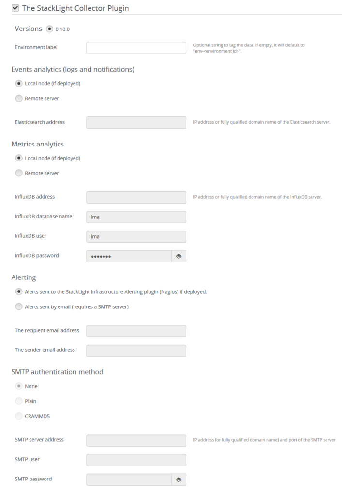

.. _config_guide:

Configuration Guide
===================

.. _plugin_configuration:

Plugin configuration
--------------------

To configure your plugin, you need to follow these steps:

1. Create a new environment following the `instructions
   <http://docs.openstack.org/developer/fuel-docs/userdocs/fuel-user-guide/create-environment/start-create-env.html>`_
   of the Fuel User Guide.

2. Click on the *Settings* tab of the Fuel web UI and select the *Other* category.

3. Scroll down through the settings until you find the StackLight Collector
   Plugin section. You should see a page like this.

4. Tick the StackLight Collector Plugin box and
   fill-in the required fields as indicated below.

  a. Provide an *Environment Label* of your choice to tag your data (optional).
  b. For the *Events Analytics* destination, select *Local node* if you plan to use the
     Elasticsearch-Kibana Plugin in the  environment. Otherwise, select *Remote server*
     and specify the fully qualified name or IP address of an external Elasticsearch server.
  c. For the *Metrics Analytics* destination, select *Local node* if you plan to use the
     InfluxDB-Grafana Plugin in the environment. Otherwise, select *Remote server* and specify
     the fully qualified name or IP address of an external InfluxDB server. Then, specify the
     InfluxDB database name you want to use, a username and password that have read and write
     access permissions.
  d. For *Alerting*, select *Alerts sent by email* if you want to receive alerts sent by email
     from the Collector. Otherwise, select *Alerts sent to a local cluster* if you plan to
     use the Infrastructure Alerting Plugin (Nagios) in the environment.
     Alternatively, you can select *Alerts sent to a remote Nagios server*.
  e. For *Alerts sent by email*, you can specify the SMTP authentication method you want to use. Then,
     specify the SMTP server fully qualified name or IP address, the SMTP username and password who
     have the permissions to send emails.
  f. Finally, specify the Nagios server URL, username and password if you have chosen to send
     alerts to an external Nagios server.

5. Configure your environment following the `instructions
   <http://docs.openstack.org/developer/fuel-docs/userdocs/fuel-user-guide/configure-environment.html>`_
   of the Fuel User Guide.

.. note:: By default, StackLight is configured to use the *management network*,
   of the so called *default node network group* created by Fuel.
   While this default setup may be appropriate for small deployments or
   evaluation purposes, it is recommended not to use the default *management network*
   for StackLight but instead create a dedicated network when configuring your environement.
   This will improve the performance of both OpenStack and StackLight overall and facilitate
   the access to the Kibana and Grafana analytics.
   Please refer to the `StackLight Planning Guide
   <http://foobar.com/>`_ for further information about
   that subject. 

6. Deploy your environment following the `instructions
   <http://docs.openstack.org/developer/fuel-docs/userdocs/fuel-user-guide/deploy-environment.html>`_
   of the Fuel User Guide.

.. note:: The StackLight Collector Plugin is a *hot-pluggable* plugin which means
   that it is possible to install and deploy the *collector* in an
   environment that is already deployed. After the installation of the StackLight
   Collector Plugin, you will need to define the settings of the plugin and then
   run the command shown below from the *Fuel master node* for every node of
   your deployment. You need to start with *the controller node(s)*::

     [root@nailgun ~]# fuel nodes --env <env_id> --node <node_id> --start \
       post_deployment_start

   If you also want to install the other plugins of the toolchain, like the
   StackLight InfluxDB-Grafana Plugin or the Stacklight Elasticsearch-Kibana Plugin,
   after an initial deployment, you will need to install and deploy those before
   the StackLight Collector Plugin.

.. _plugin_verification:

Plugin verification
-------------------

Once the OpenStack environment is ready, you should check that both
the *collectd* and *hekad* processes are running on the OpenStack nodes::

    [root@node-1 ~]# pidof hekad
    5568
    5569
    [root@node-1 ~]# pidof collectd
    5684

.. note:: Starting with StackLight version 0.10, there is not one but two *hekad* processes
   running. One is used to collect and process the logs and the notifications, the
   other one is used to process the metrics.

.. _troubleshooting:

Troubleshooting
---------------

If you see no data in the Kibana and/or Grafana dashboards,
use the instructions below to troubleshoot the problem:

1. Check that the *collector* services are up and running::

    # On the controller node(s)
    [root@node-1 ~]# crm resource status metric_collector
    [root@node-1 ~]# crm resource status log_collector

    # On non controller nodes
    [root@node-2 ~]# status log_collector
    [root@node-2 ~]# status metric_collector

2. If a *collector* is down, restart it::

    # On the controller node(s)
    [root@node-1 ~]# crm resource start log_collector
    [root@node-1 ~]# crm resource start metric_collector

    # On non controller nodes
    [root@node-2 ~]# start log_collector
    [root@node-2 ~]# start metric_collector

3. Look for errors in the log file of the *collectors*
   (located at /var/log/log_collector.log and /var/log/metric_collector.log).

4. Look for errors in the log file of *collectd* (located at /var/log/collectd.log).

5. Check if the nodes are able to connect to the Elasticsearch server on port 9200.

6. Check if the nodes are able to connect to the InfluxDB server on port 8086.
