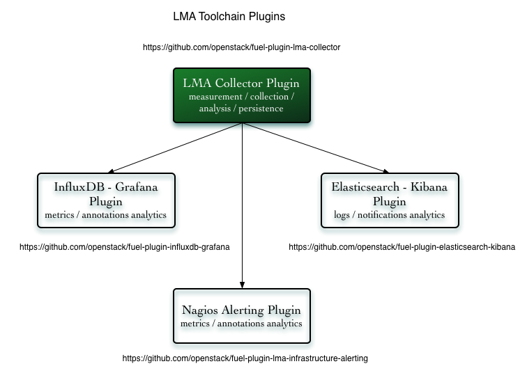

.. _user_intro:

Introduction
------------

The **StackLight Collector Plugin for Fuel** is used to install and configure
several software components that are used to collect and process all the data
that is relevant to provide deep operational insights about your OpenStack
environment. These finely integrated components are collectively referred to
as the **StackLight Collector**, or just **the Collector**.

.. note:: The Collector has evolved over time, so the term *collector* is a
   little bit of a misnomer since it is more of a *smart monitoring agent*
   than a mere data *collector*.

The Collector is the key component of the so-called
`Logging, Monitoring, and Alerting toolchain of Mirantis OpenStack
<https://launchpad.net/lma-toolchain>`_, also known as StackLight.

The Collector is installed on every node of your OpenStack environment. Each
Collector is individually responsible for supporting all the monitoring
functions of your OpenStack environment for both the operating system and the
services running on the node. The Collector running on the *primary controller*
(the controller which owns the management VIP) is called the **Aggregator**
since it performs additional aggregation and correlation functions. The
Aggregator is the central point of convergence for all the faults and
anomalies detected at the node level. The fundamental role of the Aggregator
is to issue an opinion about the health status of your OpenStack environment
at the cluster level. As such, the Collector may be viewed as a monitoring
agent for cloud infrastructure clusters.

The main building blocks of the Collector are as follows:

* The **collectd** daemon, which comes bundled with a collection of monitoring
  plugins. Some of them are standard collectd plugins while others are
  purpose-built plugins written in Python to perform various OpenStack
  services checks.
* **Heka**, `a golang data-processing multifunctional tool by Mozilla
  <https://github.com/mozilla-services/heka>`_. Heka supports a number of
  standard input and output plugins that allows to ingest data from a variety
  of sources including collectd, log files, and RabbitMQ, as well as to
  persist the operational data to external back-end servers like Elasticsearch,
  InfluxDB, and Nagios for search and further processing.
* **A collection of Heka plugins** written in Lua, which perform the actual
  data processing such as running metrics transformations, running alarms, and
  logs parsing.

.. note:: An important function of the Collector is to normalize
   the operational data into an internal `Heka message structure
   <https://hekad.readthedocs.io/en/stable/message/index.html>`_
   representation that can be ingested into the Heka's stream-processing
   pipeline. The stream-processing pipeline uses matching policies to
   route the Heka messages to the `Lua <http://www.lua.org/>`_ plugins that
   perform the actual data-computation functions.

The following Lua plugins were developed for the Collector:

* **decoder plugins** sanitize and normalize the ingested data.
* **filter plugins** process the data.
* **encoder plugins** serialize the data that is sent to the back-end servers.

The following are the types of data sent by the Collector (and the Aggregator)
to the back-end servers:

* The logs and the notifications, which are referred to as events sent to
  Elasticsearch for indexing.
* The metric's time-series sent to InfluxDB.
* The annotations sent to InfluxDB.
* The OpenStack environment clusters health status sent as *passive checks*
  to Nagios.

.. note:: The annotations are like notification messages that are exposed in
   Grafana. They contain information about the anomalies and faults that have
   been detected by the Collector. Annotations basically contain the same
   information as the *passive checks* sent to Nagios. In addition, they may
   contain hints on what can be the root cause of a problem.